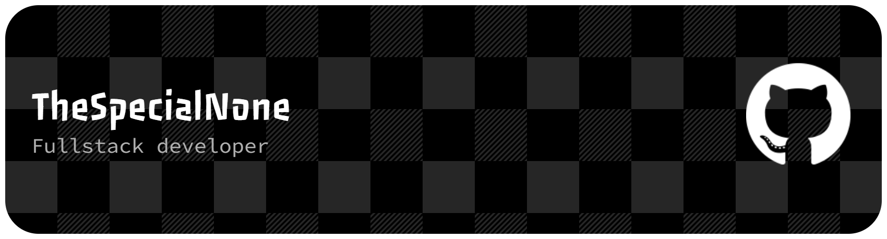

 

<h1 align="center">Hey, I'm TheSpecialNone</h1>

<i>/ðə ˈspɛʃ.əl nʌn/</i>

<h3 align="center">Hey! I'm a JavaScript, Lua & Python dev coding Roblox games and building web projects.</h3>

  
  

 

I mostly work in Lua, building Roblox experiences under my own group, **[Spec Interactive](https://www.roblox.com/communities/35995419/Spec-Interactive#!/about)**. Outside of that, I write Python for scripts and tools, and occasionally build small things with JavaScript and HTML.

My main project right now is **Volta Blox League**, which has passed **22k+ visits** on Roblox.

## What I'm into
- Building and maintaining Roblox games under Spec Interactive
- Building small web tools and plugins with CSS and HTML

## Featured Projects
| Project | Description |
|---|---|
| 🎮 [Volta Blox League](https://www.roblox.com/games/74155155335026/Volta-Blox-League) | My Roblox game, 22k+ visits and counting |
| 🔗 [VBL](https://github.com/TheSpecialNone/VBL) | The bot which I developed for Volta Blox League |
| 🔗 [paintdotnet-rpc](https://github.com/TheSpecialNone/paintdotnet-rpc) | Discord Rich Presence for Paint.NET revamped |
| 🔗 [donations](https://github.com/TheSpecialNone/donations) | A simple donations website I made |

## Skills

**Languages, Frameworks & Tools**

  
  
  
  
  
  
  
  
  
  

**Databases**

  
  
  

**Cloud Services**

  
  

**Game Engines**

  

## GitHub Stats

  
  

